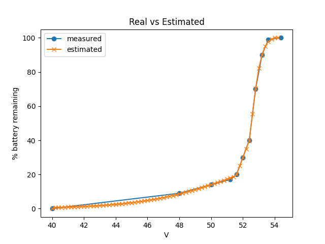

Overview
--------

Approximate state-of-charge (battery remaining) function for the Renogy BMS
using a 48v LiFePO4 battery.



Data was measured from a single battery. Your battery might have slightly
different voltage measurements b/c there is often some minor variance between
batteries. There is a small top-end and low-end buffer to account for this but
your estimate might be few points off.

Usage
-----

```
from socRenogy48VLiFeOP4 import SOC

# Compute battery remaining at 51.2V
soc = SOC(51.2)
print(soc)
```

